# Maxime Germis

## Web Developer · UI/UX Design · France

---

I build web applications and care a lot about how they look and feel. My background
is PHP — real projects, real architecture, real constraints — and I'm currently
transitioning into the React / Next.js ecosystem.

I pay attention to interfaces. Not just "does it work" but "does it make sense,
does it breathe, does it feel right."

Outside of code: independent radio shows, local associations, too many hours on
board games and video games.

---

### Stack

#### Languages

#### Front-end

shadcn/ui · Prisma · PostgreSQL

#### Tooling

#### Design

---

### Projects

**Astra-Greta** · _PHP · MySQL · Vanilla JS · SCSS_

Full-stack inventory and student tracking system for a vocational training center.
Role-based access control, CSRF protection, audit trail, CSV import/export,
PDF generation, email system. Everything custom.

> 25 controllers · 28 models · 68 DB tables · ~140 routes

_More coming — currently building with React and Next.js._

---

### Metrics

|            Activity & Languages             |             Repos & Topics             |
| :-----------------------------------------: | :------------------------------------: |
|  |  |

---

[LinkedIn](https://www.linkedin.com/in/maxime-germis/) · [Behance](https://www.behance.net/maximegermis/projects)
